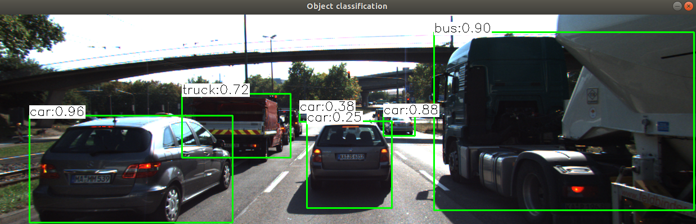
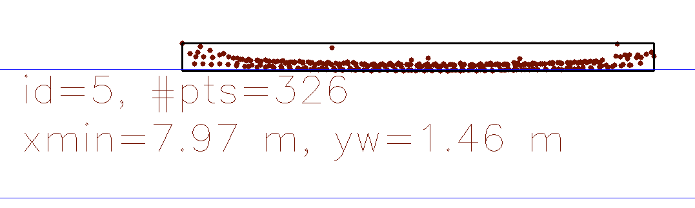
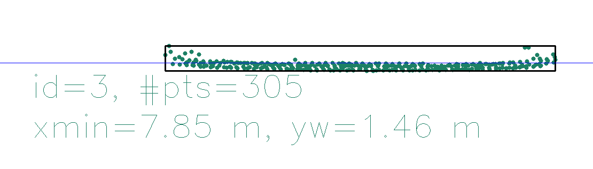
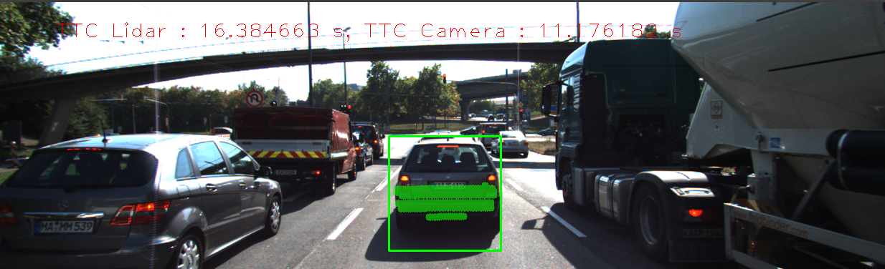
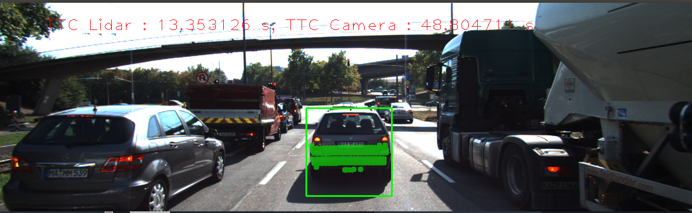
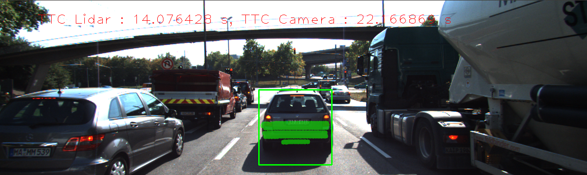

# SFND 3D Object Tracking
 
Welcome to the final project of the camera course. By completing all the lessons, you now have a solid understanding of keypoint detectors, descriptors, and methods to match them between successive images. Also, you know how to detect objects in an image using the YOLO deep-learning framework. And finally, you know how to associate regions in a camera image with Lidar points in 3D space. Let's take a look at our program schematic to see what we already have accomplished and what's still missing.

In this final project, you will implement the missing parts in the schematic. To do this, you will complete four major tasks: 
1. First, you will develop a way to match 3D objects over time by using keypoint correspondences. 
2. Second, you will compute the TTC based on Lidar measurements. 
3. You will then proceed to do the same using the camera, which requires to first associate keypoint matches to regions of interest and then to compute the TTC based on those matches. 
4. And lastly, you will conduct various tests with the framework. Your goal is to identify the most suitable detector/descriptor combination for TTC estimation and also to search for problems that can lead to faulty measurements by the camera or Lidar sensor. In the last course of this Nanodegree, you will learn about the Kalman filter, which is a great way to combine the two independent TTC measurements into an improved version which is much more reliable than a single sensor alone can be. But before we think about such things, let us focus on your final project in the camera course. 
#### 1. Match 3D Objects

Implement the method "matchBoundingBoxes", which takes as input both the previous and the current data frames and provides as output the ids of the matched regions of interest (i.e. the boxID property). Matches must be the ones with the highest number of keypoint correspondences.

#### 2. Compute Lidar-based TTC

Compute the time-to-collision in second for all matched 3D objects using only Lidar measurements from the matched bounding boxes between current and previous frame.

#### 3. Associate Keypoint Correspondences with Bounding Boxes

Prepare the TTC computation based on camera measurements by associating keypoint correspondences to the bounding boxes which enclose them. All matches which satisfy this condition must be added to a vector in the respective bounding box.

#### 4. Compute Camera-based TTC

Compute the time-to-collision in second for all matched 3D objects using only keypoint correspondences from the matched bounding boxes between current and previous frame.

#### 5.  Performance Evaluation 1

Find examples where the TTC estimate of the Lidar sensor does not seem plausible. Describe your observations and provide a sound argumentation why you think this happened.

Wrong estimations:
 
 
 
 
Most lidar estimations are stable and robust. Some edge case like this image shown is could overestimate the lidar TTC. 

#### 6. Performance Evaluation 2

Run several detector / descriptor combinations and look at the differences in TTC estimation. Find out which methods perform best and also include several examples where camera-based TTC estimation is way off. As with Lidar, describe your observations again and also look into potential reasons.
 
  

This error generated by SHITOMASI/BRIEF maybe caused by wrong keypoint detection and other image noises. 

|Detector| Descriptor | Current Image Frame | Lidar TTC | Camera TTC | Difference in TTC | Lidar TTC Average | Camera TTC Average |
|--------|------------|---------------------|-----------|------------|-------------------|-------------------|-------------------|
|SHITOMASI|BRISK|3|16.3847|-1.33021|17.7149|12.8434|11.5448|
|SHITOMASI|BRIEF|2|13.3531|48.8047|35.4516|14.8689|29.9904|
|SHITOMASI|ORB|13|9.42492|11.4982|2.07328|11.7191|11.9069|
|SHITOMASI|FREAK|12|9.88725|-1.28216|11.1694|9.39289|6.8492|
|FAST|ORB|13|9.42492|12.9831|3.55822|11.0211|12.6296|
|FAST|BRISK|3|16.3847|56.7517|40.3671|13.5892|17.9911|
|FAST|BRIEF|16|8.89854|12.466|3.56744|10.0863|12.4591|
|SIFT|BRIEF|4|14.0764|28.8191|14.7427|11.6271|15.8835|
|HARRIS|BRISK|18|8.53575|0.687055|7.84869|9.2115|6.32031|

Based on the evaluation on the difference of camera and lidar TTC, the TOP3 detector / descriptor combinations as the best choice for our purpose of detecting keypoints on vehicles are:            

SHITOMASI/ORB

FAST/ORB

FAST/BRIEF  

