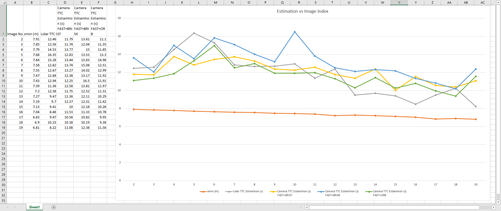
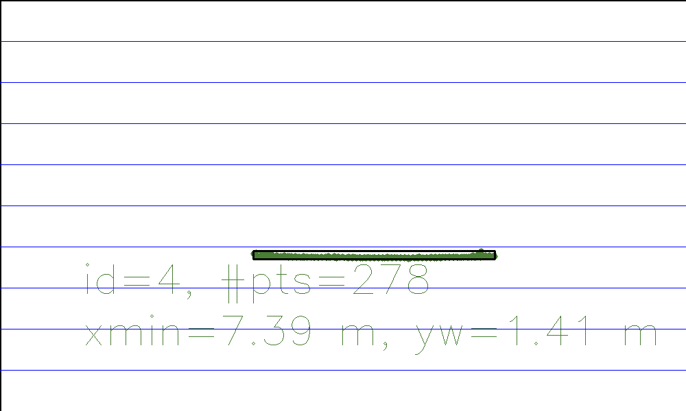
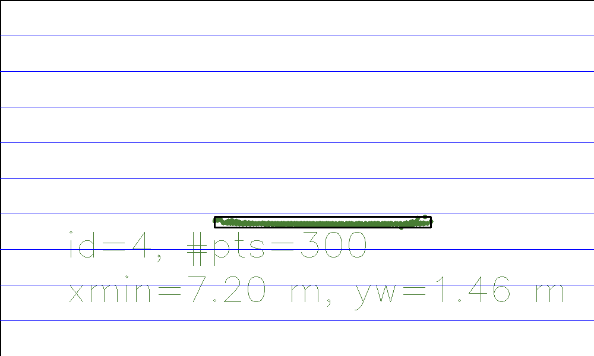
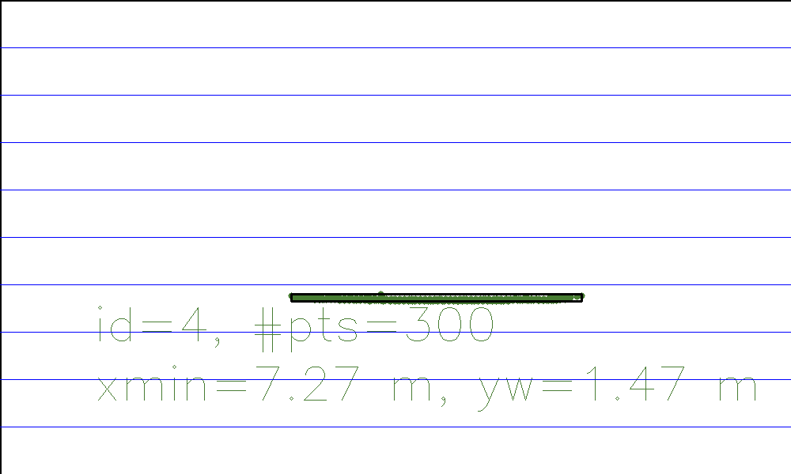
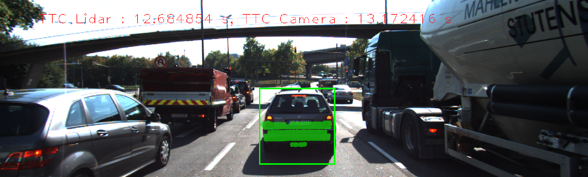
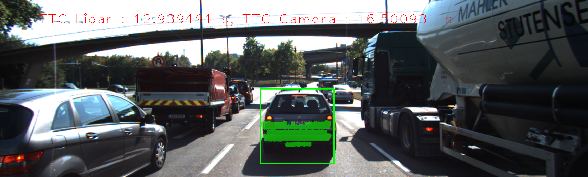
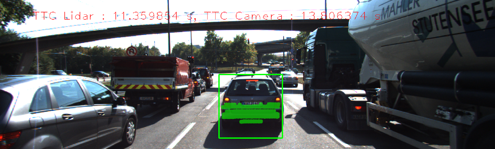

# SFND-Term1-P3-3D-Object-Tracking
Project 3 of Udacity Sensor Fusion Nanodegree  


## Overview  
In this project, you will fill some methods in a C++ script to measure the distance from Lidar and Camera sensor and associated them to the 3D object between a series of successive images. You will be using the YOLO deep-learning framework in the object detection. You will associate regions in a camera image with Lidar points in 3D space. You are going to evaluate the performance of Lidar TTC estimation and Camera TTC estimation to find the possible faulty estimation. This project consists of four parts:

* First, you will develop a way to match 3D objects over time by using keypoint correspondences.  
* Then, you will compute the TTC based on Lidar measurements. 
* You will then proceed to do the same using the camera, which requires to first associate keypoint matches to regions of interest and then to compute the TTC based on those matches. 
* And lastly, you will conduct various tests with the framework. Your goal is to identify the most suitable detector/descriptor combination for TTC estimation and also to search for problems that can lead to faulty measurements by the camera or Lidar sensor. 

## Prerequisites/Dependencies  
* cmake >= 2.8
  * All OSes: [click here for installation instructions](https://cmake.org/install/)
* make >= 4.1 (Linux, Mac), 3.81 (Windows)
  * Linux: make is installed by default on most Linux distros
  * Mac: [install Xcode command line tools to get make](https://developer.apple.com/xcode/features/)
  * Windows: [Click here for installation instructions](http://gnuwin32.sourceforge.net/packages/make.htm)
* Git LFS
  * Weight files are handled using [LFS](https://git-lfs.github.com/)
* OpenCV >= 4.1
  * This must be compiled from source using the `-D OPENCV_ENABLE_NONFREE=ON` cmake flag for testing the SIFT and SURF detectors.
  * The OpenCV 4.1.0 source code can be found [here](https://github.com/opencv/opencv/tree/4.1.0)
* gcc/g++ >= 5.4
  * Linux: gcc / g++ is installed by default on most Linux distros
  * Mac: same deal as make - [install Xcode command line tools](https://developer.apple.com/xcode/features/)
  * Windows: recommend using [MinGW](http://www.mingw.org/)

## (TODO) Project Description  
```
.SFND-Term1-P3-3D-Object-Tracking                  # 3D Object Tracking Project
├── CMakeLists.txt
├── dat
│   └── yolo
│       ├── coco.names
│       ├── yolov3.cfg
│       ├── yolov3-tiny.cfg
│       └── yolov3-tiny.weights
├── images
│   ├── course_code_structure.png
│   └── KITTI
│       └── 2011_09_26
│           ├── image_02
│           │   └── data
│           │       ├── 0000000000.png
│           │       ├── 0000000001.png
│           │       ├── 0000000002.png
│           │       ├── 0000000003.png
│           │       ├── 0000000004.png
│           │       ├── 0000000005.png
│           │       ├── 0000000006.png
│           │       ├── 0000000007.png
│           │       ├── 0000000008.png
│           │       ├── 0000000009.png
│           │       ├── 0000000010.png
│           │       ├── 0000000011.png
│           │       ├── 0000000012.png
│           │       ├── 0000000013.png
│           │       ├── 0000000014.png
│           │       ├── 0000000015.png
│           │       ├── 0000000016.png
│           │       ├── 0000000017.png
│           │       ├── 0000000018.png
│           │       ├── 0000000019.png
│           │       ├── 0000000020.png
│           │       ├── 0000000021.png
│           │       ├── 0000000022.png
│           │       ├── 0000000023.png
│           │       ├── 0000000024.png
│           │       ├── 0000000025.png
│           │       ├── 0000000026.png
│           │       ├── 0000000027.png
│           │       ├── 0000000028.png
│           │       ├── 0000000029.png
│           │       ├── 0000000030.png
│           │       ├── 0000000031.png
│           │       ├── 0000000032.png
│           │       ├── 0000000033.png
│           │       ├── 0000000034.png
│           │       ├── 0000000035.png
│           │       ├── 0000000036.png
│           │       ├── 0000000037.png
│           │       ├── 0000000038.png
│           │       ├── 0000000039.png
│           │       ├── 0000000040.png
│           │       ├── 0000000041.png
│           │       ├── 0000000042.png
│           │       ├── 0000000043.png
│           │       ├── 0000000044.png
│           │       ├── 0000000045.png
│           │       ├── 0000000046.png
│           │       ├── 0000000047.png
│           │       ├── 0000000048.png
│           │       ├── 0000000049.png
│           │       ├── 0000000050.png
│           │       ├── 0000000051.png
│           │       ├── 0000000052.png
│           │       ├── 0000000053.png
│           │       ├── 0000000054.png
│           │       ├── 0000000055.png
│           │       ├── 0000000056.png
│           │       ├── 0000000057.png
│           │       ├── 0000000058.png
│           │       ├── 0000000059.png
│           │       ├── 0000000060.png
│           │       ├── 0000000061.png
│           │       ├── 0000000062.png
│           │       ├── 0000000063.png
│           │       ├── 0000000064.png
│           │       ├── 0000000065.png
│           │       ├── 0000000066.png
│           │       ├── 0000000067.png
│           │       ├── 0000000068.png
│           │       ├── 0000000069.png
│           │       ├── 0000000070.png
│           │       ├── 0000000071.png
│           │       ├── 0000000072.png
│           │       ├── 0000000073.png
│           │       ├── 0000000074.png
│           │       ├── 0000000075.png
│           │       ├── 0000000076.png
│           │       └── 0000000077.png
│           └── velodyne_points
│               └── data
│                   ├── 0000000000.bin
│                   ├── 0000000001.bin
│                   ├── 0000000002.bin
│                   ├── 0000000003.bin
│                   ├── 0000000004.bin
│                   ├── 0000000005.bin
│                   ├── 0000000006.bin
│                   ├── 0000000007.bin
│                   ├── 0000000008.bin
│                   ├── 0000000009.bin
│                   ├── 0000000010.bin
│                   ├── 0000000011.bin
│                   ├── 0000000012.bin
│                   ├── 0000000013.bin
│                   ├── 0000000014.bin
│                   ├── 0000000015.bin
│                   ├── 0000000016.bin
│                   ├── 0000000017.bin
│                   ├── 0000000018.bin
│                   ├── 0000000019.bin
│                   ├── 0000000020.bin
│                   ├── 0000000021.bin
│                   ├── 0000000022.bin
│                   ├── 0000000023.bin
│                   ├── 0000000024.bin
│                   ├── 0000000025.bin
│                   ├── 0000000026.bin
│                   ├── 0000000027.bin
│                   ├── 0000000028.bin
│                   ├── 0000000029.bin
│                   ├── 0000000030.bin
│                   ├── 0000000031.bin
│                   ├── 0000000032.bin
│                   ├── 0000000033.bin
│                   ├── 0000000034.bin
│                   ├── 0000000035.bin
│                   ├── 0000000036.bin
│                   ├── 0000000037.bin
│                   ├── 0000000038.bin
│                   ├── 0000000039.bin
│                   ├── 0000000040.bin
│                   ├── 0000000041.bin
│                   ├── 0000000042.bin
│                   ├── 0000000043.bin
│                   ├── 0000000044.bin
│                   ├── 0000000045.bin
│                   ├── 0000000046.bin
│                   ├── 0000000047.bin
│                   ├── 0000000048.bin
│                   ├── 0000000049.bin
│                   ├── 0000000050.bin
│                   ├── 0000000051.bin
│                   ├── 0000000052.bin
│                   ├── 0000000053.bin
│                   ├── 0000000054.bin
│                   ├── 0000000055.bin
│                   ├── 0000000056.bin
│                   ├── 0000000057.bin
│                   ├── 0000000058.bin
│                   ├── 0000000059.bin
│                   ├── 0000000060.bin
│                   ├── 0000000061.bin
│                   ├── 0000000062.bin
│                   ├── 0000000063.bin
│                   ├── 0000000064.bin
│                   ├── 0000000065.bin
│                   ├── 0000000066.bin
│                   ├── 0000000067.bin
│                   ├── 0000000068.bin
│                   ├── 0000000069.bin
│                   ├── 0000000070.bin
│                   ├── 0000000071.bin
│                   ├── 0000000072.bin
│                   ├── 0000000073.bin
│                   ├── 0000000074.bin
│                   ├── 0000000075.bin
│                   ├── 0000000076.bin
│                   └── 0000000077.bin
├── README.md
├── results
│   ├── FAST+BRIEF
│   │   ├── Final_Results_-_TTC_screenshot_04.05.2020_002.png
│   │   ├── Final_Results_-_TTC_screenshot_04.05.2020_003.png
│   │   ├── Final_Results_-_TTC_screenshot_04.05.2020_004.png
│   │   ├── Final_Results_-_TTC_screenshot_04.05.2020_005.png
│   │   ├── Final_Results_-_TTC_screenshot_04.05.2020_006.png
│   │   ├── Final_Results_-_TTC_screenshot_04.05.2020_007.png
│   │   ├── Final_Results_-_TTC_screenshot_04.05.2020_008.png
│   │   ├── Final_Results_-_TTC_screenshot_04.05.2020_009.png
│   │   ├── Final_Results_-_TTC_screenshot_04.05.2020_010.png
│   │   ├── Final_Results_-_TTC_screenshot_04.05.2020_011.png
│   │   ├── Final_Results_-_TTC_screenshot_04.05.2020_012.png
│   │   ├── Final_Results_-_TTC_screenshot_04.05.2020_013.png
│   │   ├── Final_Results_-_TTC_screenshot_04.05.2020_014.png
│   │   ├── Final_Results_-_TTC_screenshot_04.05.2020_015.png
│   │   ├── Final_Results_-_TTC_screenshot_04.05.2020_016.png
│   │   ├── Final_Results_-_TTC_screenshot_04.05.2020_017.png
│   │   ├── Final_Results_-_TTC_screenshot_04.05.2020_018.png
│   │   ├── Final_Results_-_TTC_screenshot_04.05.2020_019.png
│   │   └── No Final Results - TTC_screenshot_04.05.2020_001
│   ├── FAST+BRISK
│   │   ├── Final_Results_-_TTC_screenshot_04.05.2020_002.png
│   │   ├── Final_Results_-_TTC_screenshot_04.05.2020_003.png
│   │   ├── Final_Results_-_TTC_screenshot_04.05.2020_004.png
│   │   ├── Final_Results_-_TTC_screenshot_04.05.2020_005.png
│   │   ├── Final_Results_-_TTC_screenshot_04.05.2020_006.png
│   │   ├── Final_Results_-_TTC_screenshot_04.05.2020_007.png
│   │   ├── Final_Results_-_TTC_screenshot_04.05.2020_008.png
│   │   ├── Final_Results_-_TTC_screenshot_04.05.2020_009.png
│   │   ├── Final_Results_-_TTC_screenshot_04.05.2020_010.png
│   │   ├── Final_Results_-_TTC_screenshot_04.05.2020_011.png
│   │   ├── Final_Results_-_TTC_screenshot_04.05.2020_012.png
│   │   ├── Final_Results_-_TTC_screenshot_04.05.2020_013.png
│   │   ├── Final_Results_-_TTC_screenshot_04.05.2020_014.png
│   │   ├── Final_Results_-_TTC_screenshot_04.05.2020_015.png
│   │   ├── Final_Results_-_TTC_screenshot_04.05.2020_016.png
│   │   ├── Final_Results_-_TTC_screenshot_04.05.2020_017.png
│   │   ├── Final_Results_-_TTC_screenshot_04.05.2020_018.png
│   │   ├── Final_Results_-_TTC_screenshot_04.05.2020_019.png
│   │   └── No Final Results - TTC_screenshot_04.05.2020_001
│   ├── FAST+ORB
│   │   ├── Final_Results_-_TTC_screenshot_04.05.2020_002.png
│   │   ├── Final_Results_-_TTC_screenshot_04.05.2020_003.png
│   │   ├── Final_Results_-_TTC_screenshot_04.05.2020_004.png
│   │   ├── Final_Results_-_TTC_screenshot_04.05.2020_005.png
│   │   ├── Final_Results_-_TTC_screenshot_04.05.2020_006.png
│   │   ├── Final_Results_-_TTC_screenshot_04.05.2020_007.png
│   │   ├── Final_Results_-_TTC_screenshot_04.05.2020_008.png
│   │   ├── Final_Results_-_TTC_screenshot_04.05.2020_009.png
│   │   ├── Final_Results_-_TTC_screenshot_04.05.2020_010.png
│   │   ├── Final_Results_-_TTC_screenshot_04.05.2020_011.png
│   │   ├── Final_Results_-_TTC_screenshot_04.05.2020_012.png
│   │   ├── Final_Results_-_TTC_screenshot_04.05.2020_013.png
│   │   ├── Final_Results_-_TTC_screenshot_04.05.2020_014.png
│   │   ├── Final_Results_-_TTC_screenshot_04.05.2020_015.png
│   │   ├── Final_Results_-_TTC_screenshot_04.05.2020_016.png
│   │   ├── Final_Results_-_TTC_screenshot_04.05.2020_017.png
│   │   ├── Final_Results_-_TTC_screenshot_04.05.2020_018.png
│   │   ├── Final_Results_-_TTC_screenshot_04.05.2020_019.png
│   │   └── No Final Results - TTC_screenshot_04.05.2020_001
│   ├── Lidar
│   │   ├── 3D_Objects_screenshot_04.05.2020_001.png
│   │   ├── 3D_Objects_screenshot_04.05.2020_002.png
│   │   ├── 3D_Objects_screenshot_04.05.2020_003.png
│   │   ├── 3D_Objects_screenshot_04.05.2020_004.png
│   │   ├── 3D_Objects_screenshot_04.05.2020_005.png
│   │   ├── 3D_Objects_screenshot_04.05.2020_006.png
│   │   ├── 3D_Objects_screenshot_04.05.2020_007.png
│   │   ├── 3D_Objects_screenshot_04.05.2020_008.png
│   │   ├── 3D_Objects_screenshot_04.05.2020_009.png
│   │   ├── 3D_Objects_screenshot_04.05.2020_010.png
│   │   ├── 3D_Objects_screenshot_04.05.2020_011.png
│   │   ├── 3D_Objects_screenshot_04.05.2020_012.png
│   │   ├── 3D_Objects_screenshot_04.05.2020_013.png
│   │   ├── 3D_Objects_screenshot_04.05.2020_014.png
│   │   ├── 3D_Objects_screenshot_04.05.2020_015.png
│   │   ├── 3D_Objects_screenshot_04.05.2020_016.png
│   │   ├── 3D_Objects_screenshot_04.05.2020_017.png
│   │   ├── 3D_Objects_screenshot_04.05.2020_018.png
│   │   └── 3D_Objects_screenshot_04.05.2020_019.png
│   ├── Object classification_screenshot_04.05.2020.png
│   └── Summary_Chart.png
└── src
    ├── camFusion.hpp
    ├── camFusion_Student.cpp
    ├── dataStructures.h
    ├── FinalProject_Camera.cpp
    ├── lidarData.cpp
    ├── lidarData.hpp
    ├── matching2D.hpp
    ├── matching2D_Student.cpp
    ├── objectDetection2D.cpp
    └── objectDetection2D.hpp

```

- [CMakeLists.txt](/src/CMakeLists.txt): File to link the C++ code to libraries.  
- [MidTermProject_Camera_Student.cpp](/src/MidTermProject_Camera_Student.cpp): C++ script, main function to load and analyze images  
- [matching2D_Student.cpp](/src/matching2D_Student.cpp): C++ script, helper function, create detector and descriptor, and compute the matched keypoint with given threshold and ratio  
- [matching2D.h](/src/matching2D.hpp): Header file, define libraries and functions for matching2D_Student.cpp  
- [dataStructures.h](/src/quiz/cluster/kdtree.h): Header file, define libraries and functions for data structure  

## Run the project  
* Clone this repository  
```
git clone https://github.com/jinchaolu/SFND-Term1-P3-3D-Object-Tracking.git
```
* Navigate to the `SFND-Term1-P3-3D-Object-Tracking` folder  
```
cd SFND-Term1-P3-3D-Object-Tracking
```
* Create and open `build` folder  
```
mkdir build && cd build
```
* Compile your code  
```
cmake .. && make
```
* Run `3D_object_tracking` application  
```
./3D_object_tracking
```

## Tips  
1. It's recommended to update and upgrade your environment before running the code.  
```
sudo apt-get update && sudo apt-get upgrade -y
```
2. You might encounter some segmentation fault. Might be caused by the incomplete yolov3.weights. Download the dataset again with the following command.  
```
wget https://pjreddie.com/media/files/yolov3.weights
```

## Code Style  
Please (do your best to) stick to [Google's C++ style guide](https://google.github.io/styleguide/cppguide.html).  

## Project Rubric  
### 1. FP.0 Final Report  
#### 1.1 Provide a Writeup / README that includes all the rubric points and how you addressed each one. You can submit your writeup as markdown or pdf.  
Done. You are reading it.  

### 2. FP.1 Match 3D Objects  
#### 2.1 Implement the method "matchBoundingBoxes", which takes as input both the previous and the current data frames and provides as output the ids of the matched regions of interest (i.e. the boxID property). Matches must be the ones with the highest number of keypoint correspondences.  
This method is implemented here [camFusion_Student.cpp (Line 290-343)](./src/camFusion_Student.cpp#L290-L343).  

### 3. FP.2 Compute Lidar-based TTC  
#### 3.1 Compute the time-to-collision in second for all matched 3D objects using only Lidar measurements from the matched bounding boxes between current and previous frame.  
This method is implemented here [camFusion_Student.cpp (Line 235-287)](./src/camFusion_Student.cpp#L235-L287).  

### 4. FP.3 Associate Keypoint Correspondences with Bounding Boxes  
#### 4.1 Prepare the TTC computation based on camera measurements by associating keypoint correspondences to the bounding boxes which enclose them. All matches which satisfy this condition must be added to a vector in the respective bounding box.  
This method is implemented here [camFusion_Student.cpp (Line 138-172)](./src/camFusion_Student.cpp#L138-L172).  

### 5. FP.4 Compute Camera-based TTC  
#### 5.1 Compute the time-to-collision in second for all matched 3D objects using only keypoint correspondences from the matched bounding boxes between current and previous frame.  
This method is implemented here [camFusion_Student.cpp (Line 176-232)](./src/camFusion_Student.cpp#L176-L232).  

### 6. FP.5 Performance Evaluation 1  
#### 6.1 Find examples where the TTC estimate of the Lidar sensor does not seem plausible. Describe your observations and provide a sound argumentation why you think this happened.  

Below please find the [`Summary Chart`](./results/Summary_Chart.png) for overview  
  

The Lidar TTC estimation on Image No. 12 doesn't seem right as the trend line is going down.  
We will look into the Lidar data point distribution from top-view to analyze between Image No. 11 and 13.  

`Lidar data point top-view 11`  
The data point distribution is well concentrated. Data points are almost lined up.  
  

`Lidar data point top-view 12`  
The data point distribution is a little bit spread out. Data points are not lined up well as previous one.  
  

`Lidar data point top-view 13`  
The data point distribution is well concentrated. Data points are almost lined up.  
  

From above observation, the data distribution spread out in Image No. 12 contribute to the jump on the Lidar TTC estimation. To improve the estimation, we can apply a low-pass filter with appropriate alpha to smoothe the estimation.  

### 7. FP.6 Performance Evaluation 2  
#### 7.1 Run several detector / descriptor combinations and look at the differences in TTC estimation. Find out which methods perform best and also include several examples where camera-based TTC estimation is way off. As with Lidar, describe your observations again and also look into potential reasons.  

Below please find the TOP3 detector / descriptor combinations are recommened as the best choice for our purpose of detecting keypoints on vehicles from the mid-term project [`SFND-Term1-P2-2D-Feature-Tracking`](https://github.com/jinchaolu/SFND-Term1-P2-2D-Feature-Tracking).  
We will evaluate the performance on each combination for comparison.  
* **FAST + BRIEF**
* **FAST + BRISK**
* **FAST + ORB**

Camera TTC estimation resulte are shown in the table below.  
| Image No. | xmin (m) | Lidar TTC Estiamtion (s) | Camera TTC Estiamtion (s)<br />FAST + BRIEF| Camera TTC Estiamtion (s)<br />FAST + BRISK | Camera TTC Estiamtion (s)<br />FAST + ORB |
| :---: | :---: | :-----: | :---: | :---: | :---: |
| 1     | 7.97  | N/A     | N/A   | N/A   | N/A   |
| 2     | 7.91  | 12.46   | 11.79 | 13.61 | 11.10 |
| 3     | 7.85  | 12.56   | 11.74 | 12.04 | 11.35 |
| 4     | 7.79  | 14.53   | 13.77 | 15.00 | 11.85 |
| 5     | 7.68  | 16.35   | 12.83 | 13.53 | 13.30 |
| 6     | 7.64  | 15.28   | 13.44 | 15.83 | 14.98 |
| 7     | 7.58  | 12.82   | 13.74 | 15.08 | 12.51 |
| 8     | 7.55  | 12.67   | 13.27 | 14.02 | 12.99 |
| 9     | 7.47  | 12.68   | 12.38 | 13.17 | 11.92 |
| 10    | 7.43  | 12.94   | 12.25 | 16.50 | 11.91 |
| 11    | 7.39  | 11.36   | 12.58 | 13.81 | 11.97 |
| 12    | 7.20  | 12.38   | 11.75 | 12.52 | 11.31 |
| 13    | 7.27  | 9.47    | 11.36 | 12.11 | 10.29 |
| 14    | 7.19  | 9.70    | 12.37 | 12.31 | 11.42 |
| 15    | 7.13  | 9.41    | 10.00 | 12.18 | 10.26 |
| 16    | 7.04  | 8.48    | 11.53 | 11.33 | 10.78 |
| 17    | 6.83  | 9.47    | 10.56 | 10.82 | 9.95  |
| 18    | 6.90  | 10.23   | 10.38 | 10.19 | 9.38  |
| 19    | 6.81  | 8.22    | 11.08 | 12.38 | 11.56 |

In summary, the combination **FAST + BRIEF** has the most smoothy and stable TTC estimation and is highly recommended to use for future application. The combination **FAST + BRISK** has the worst TTC estimation according to the big distribution. The combination **FAST + ORB** has the median estimation among all of three combinations.  

We will take a look into the **FAST + BRISK** between Image No. 9 and 11.  

`FAST + BRISK 9`  
  

`FAST + BRISK 10`  
  

`FAST + BRISK 11`  
  

Matched points in the ground or in other cars might occurred in the Image No.10 which will create inconsistent and unstable distance measurement on the preceeding car. To resolve this, we can switch to other detector and descriptor combination for better result like **FAST + BRIEF**.  
